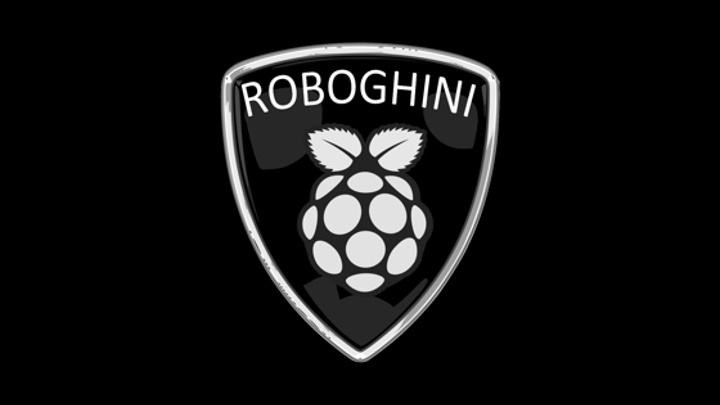

# roboghini-pi
self-driving car prototype using OpenCV

# The Robo-ghini Pi: DIY Computer Vision for a Self-driving Car

Automobiles that drive themselves are now cruising our roadways. It
isn't magic! Combining a 1/24 scale Lamborghini, a Raspberry Pi
computer, a digital camera, and integrating "Computer Vision" open
source software, Kipp will show off a DIY concept car that actually
drives itself.

# How It Works

docs/README.md - speaker notes from a talk I gave

# Train the Vision System

captureImages.py - read capture server and save images for cascade analysis

createSamples.sh - read positive and negative images; write .vec file

traincascade.sh - read .vec file; read negative images; create cascade.xml

# Drive the Roboghini Pi

install.sh - push the application and the vision system to the Roboghini Pi

car.py - wrap the gpio with pulse width modulation; implement drive forward, reverse, left, right

camera.py - wrap the picamera with a thread

drive.py - read camera, run the cascade, drive the car

roboghini.py - run a cherrypy server to share the car camera

index.html - update car home page with camera and recognized image

# Sample Data

stopsign/ - positive images for recognition

negative/ - negative images for recognition

# Test

detect.py - read the positive images and report the matched bounding box

picamera.py - mock object for Pi camera

gpiozero.py - mock object for Pi pin output

