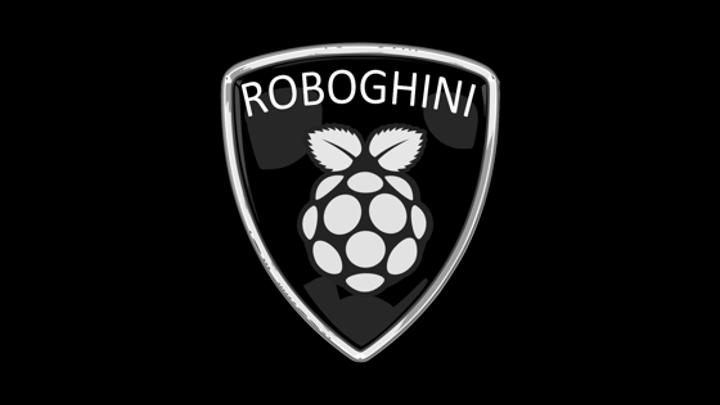

# The Roboghini Pi: DIY Computer Vision for a Self-driving Car

(speaker notes and some slides from a talk I gave in 2016)

The Roboghini Pi is a do-it-yourself, self-driving car.

"The earliest self-driving car was just a horse that knew its way
home." -- my eldest, insightful daughter.

## Google

You may have heard of the Google Self-Driving Car.

- Lasers, radar, and cameras detect the environment
- Interior is designed for RIDING not DRIVING
- All electric
- On-board computing and redundant computing
- Driven 2 million miles (2016)
- All about safety

National Highway Traffic Safety Administration (NHTSA)
has a rating system that includes
"full self-driving automation (level 4)."
Other cars have levels 1-3 for a semi-automated implementation.

Google's car. Maximum speed is 25 miles per hour; 35 where permitted.

Fun fact: Google cars pause 1.5 seconds after the light turns green--
because they've learned that many accidents happen during this time.

## Uber

Carnegie Mellon is a premier Computer Science school in Pittsburgh,
PA. At the start of 2015, Carnegie Mellon's National Robotics
Engineering Center employed 150 scientists, engineers, and support
crew.

But by February 2015, Uber had recruited away 40 roboticists--6
principal investigators and 34 engineers. What if your team lost a
quarter of your staff?  They now work for the brand new "Uber Advanced
Technologies Center" just down the street.

Uber started from scratch. They are serious about self-driving cars.
five million dollars of serious. Is everyone so serious? Is this a
thing?

Business Insider reports that...
* Vehicles are already on the road with self-driving features
* Full-featured, self-driving vehicles will deploy in 2019
* 10 MILLION VEHICLES with self-driving features will be on the road
  by 2020 -- 3 years

ALSO
  320 MILLION people in the US
    3.5 MILLION of them truck drivers (1 in 100)
  BREAKER BREAKER 1-9 -- trucking and its surrounding industry is AT RISK

You recall that OFFSHORING jobs caused waves in the high-tech
economy--now we have AUTOMATION threatening another core US economy

Self-driving cars? It's a big deal. But let's talk about STYLE.

What Uber is pitching is a suburban utility ... grocery-getter.
OK, it's a VOLVO.  But let's kick it up a little, shall we?

## Lamborghini Veneno Roadster

V-12 engine. 220 MPH. Zero to sixty in 2.9 seconds. Four million
dollars.  Now that's a self-driving car!

After the $4M, all we need is a computer to drive it.

A computer that can...
  - Collect data from the environment (cameras, other sensors)
  - Make decisions (forward, reverse, left, right, stop)
  - Drive drive drive

Let's explore that computer.

## Raspberry Pi

Initially released in 2012... the Raspberry Pi is a 3.5x2.25 credit
card sized computer... 

Raspberry Pi 3 model B; 4 cores; 1.2 GHz; has GPU; 1 GB RAM;
16 GB SSD ... $35...

It's an Advanced RISC Machine (ARM) architecture and runs a Debian
Linux called "Raspbian."

Raspberry Pi is five hundred times as powerful as the computer that
took us to the MOON in 1969. The Apollo 11 guidance computer: 2 MHz;
32KB RAM; weighed 70 pounds.

Power source, 4-core CPU, HDMI for video, input port for a camera,
Ethernet, four USB ports, 40 pins for basic I/O, WiFi, and a removable
solid state drive MicroSD.

Hint: most of those I/O pins are for outputting 3V to external logic
circuits.

## Selfie-of-a-Selfie

It's 2016 ... of course there's a selfie.
That's the Pi HD camera - 8MP stills; 1080p30, 720p60 video; $30.

So there's the Raspberry Pi, putting my picture on the TV
and me, taking a snapchat of the TV.

Budget-wise, I'm at $65 for the control system.  Now I just need $4M
for the Lamborghini. Let's check online.

## RC Lamborghini

Electric, remote control 1:24 scale Lamborghini Veneno Roadster.
$20. Free shipping with an annual membership.

Before I even drove it, I had hacked into the drive system to start
reverse engineering it.

Two servo motors. Forward/backward. Left/right. Eight transistors all
lined up.

You know how a transistor works, right?  Invented in the 1950s--one of
the greatest inventions of the 20th century.  Transistors have three
leads.  You put a tiny positive voltage on one lead (base).  And
current flows across the other two (collector and emitter).
Say... what about 3V?  So I sent 3V into each pair of transistors and
VOILA!  Servo motors engaged F/B/L/R.  And voila! The Pi can control
the Lamborghini.

## Soldering Iron

 

Here we soldered wires onto the base pins of the transistors of the
drive control of my RC Lamborghini. Then we route the wires to the I/O
pins on the Raspberry Pi.

And VOILA! 

## Roboghini Pi

That is one sexy machine... time to write some software!

Need software modules to do these things:

1. Read camera 
2. Make sense of what the camera is seeing
3. Drive car (not too fast!)
4. Report the results

ONE. Read camera? Easy--libraries come with the Pi.

TWO. To make sense of what the camera was seeing, I loaded the OpenCV
library onto the Pi and trained an object detector to recognize these
"Do Not Enter" signs at varying angles and distances.

The crisp edges and layout of the sign make for easier for the image
recognition software.

## Observing the World

Here we see the detector in action... "detectMultiScale" reads the
image data and finds where the target matches in the image.

THREE. Drive the car. All I asked it to do was go forward, steer to
the sign, back up... I had to stick in a speed limiter so the car
wouldn't go faster than the detector could detect.

This car has a mind of its own. And the prototype you will see today
only took 240 lines of Python to hold it all together.

## What the Car Sees

FOUR. To share what the car sees, I stood up a CherryPy web server on
the RaspberryPi.

On the left you see the color image; on the right you see the
grayscale where the target is recognized and marked.

So let's boot up the Roboghini Pi and see what it sees on the
display.

Now it's time for a drive!

